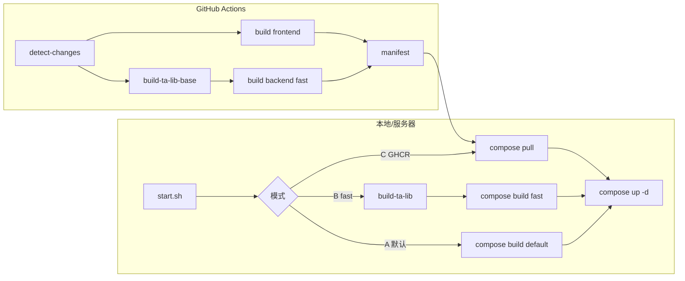

# NOFX 部署指南

本文档说明 NOFX 的 Docker 部署方式，包含**快速更新**、**加速构建**与 **CI/GHCR 拉取部署**。

> 基础 Docker 安装与故障排查见：[docker-deploy.zh-CN.md](docker-deploy.zh-CN.md)

---

## 1. 前置要求

| 组件 | 版本 |
|------|------|
| Docker | ≥ 20.10 |
| Docker Compose | v2（`docker compose`，非 `docker-compose`） |
| Git | 用于 `update` 拉代码 |

验证：

```bash
docker --version
docker compose version
```

---

## 2. 首次部署（推荐流程）

### 2.1 准备配置

```bash
cp .env.example .env
cp config.json.example config.json
# 按需编辑 .env、config.json
```

`.env` 中建议至少确认：

- `NOFX_BACKEND_PORT`（默认 `8080`）
- `NOFX_FRONTEND_PORT`（默认 `3000`）
- `DATA_ENCRYPTION_KEY`、`JWT_SECRET`（首次 `./start.sh start` 可自动引导加密设置）

### 2.2 首次启动

```bash
chmod +x start.sh
./start.sh start --build
```

`--build` 会本地构建前后端镜像（首次必用）。

### 2.3 访问

| 服务 | 地址 |
|------|------|
| Web | http://localhost:3000 |
| API 健康检查 | http://localhost:8080/api/health |

```bash
./start.sh status
```

---

## 3. 三种部署模式

根据场景选择一种即可。

### 模式 A：本地默认构建（零额外配置）

- **适用**：开发机、首次安装、无 GHCR 权限
- **特点**：后端 Dockerfile `default` target，内联编译 TA-Lib，无需预构建基座
- **命令**：

```bash
./start.sh start --build    # 首次 / 依赖变更
./start.sh start            # 仅启动已有镜像
```

### 模式 B：本地加速构建（fast + TA-Lib 基座）

- **适用**：频繁改后端 Go 代码，希望跳过每次 TA-Lib 编译
- **特点**：先构建一次 `nofx-ta-lib-base`，后端使用 `fast` target

**步骤：**

```bash
# 1. 构建 TA-Lib 基础镜像（TA-Lib 版本变更时重做）
./start.sh build-ta-lib

# 2. 在 .env 中启用 fast
```

```bash
TA_LIB_VERSION=0.4.0
NOFX_BACKEND_BUILD_TARGET=fast
TA_LIB_BASE_IMAGE=local/nofx-ta-lib-base:0.4.0
```

```bash
# 3. 构建并启动
./start.sh start --build
```

### 模式 C：生产拉取 GHCR 镜像（最快部署）

- **适用**：服务器只跑容器，不在线上编译
- **前提**：`main`/`dev` 推送后 CI 已成功推送镜像到 GHCR

**`.env` 示例：**

```bash
# 将 <owner>/<repo> 替换为实际 GitHub 仓库（小写）
NOFX_BACKEND_IMAGE=ghcr.io/<owner>/<repo>/nofx-backend:latest
NOFX_FRONTEND_IMAGE=ghcr.io/<owner>/<repo>/nofx-frontend:latest
```

**登录 GHCR（私有包时需要）：**

```bash
echo "$GITHUB_TOKEN" | docker login ghcr.io -u <github用户名> --password-stdin
```

**更新：**

```bash
./start.sh update
# 等价于: git pull && docker compose pull && docker compose up -d
```

> 若未配置 `NOFX_*_IMAGE`，`update` 的 `pull` 只会拉取 compose 里 `image` 字段的本地 tag，不会从 GHCR 获取远程镜像。

---

## 4. 日常运维命令（`start.sh`）

| 命令 | 说明 |
|------|------|
| `./start.sh start` | 启动（不重建） |
| `./start.sh start --build` | 构建镜像并启动 |
| `./start.sh stop` | 停止 |
| `./start.sh restart` | 重启容器 |
| `./start.sh logs` | 全部日志 |
| `./start.sh logs nofx` | 后端日志 |
| `./start.sh status` | 状态 + 健康检查 |
| `./start.sh update` | **快速更新**：`git pull` → `pull` → `up -d` |
| `./start.sh update --build` | 拉代码并**重新构建**镜像 |
| `./start.sh build-ta-lib` | 仅构建 TA-Lib 基础镜像 |
| `./start.sh setup-encryption` | 手动配置 RSA / 加密密钥 |

**何时用 `update` vs `update --build`：**

| 变更类型 | 推荐命令 |
|----------|----------|
| 仅配置、`prompts`、数据库 | `./start.sh restart` 或 `update`（模式 C） |
| 已用 GHCR，CI 已构建新镜像 | `./start.sh update` |
| `go.mod` / `Dockerfile` / `web/package*.json` | `./start.sh update --build` |
| TA-Lib 版本升级 | `./start.sh build-ta-lib` 然后 `update --build` |

---

## 5. 环境变量参考

复制模板：`cp .env.example .env`

### 5.1 端口与时区

| 变量 | 默认值 | 说明 |
|------|--------|------|
| `NOFX_BACKEND_PORT` | `8080` | 宿主机 API 端口 |
| `NOFX_FRONTEND_PORT` | `3000` | 宿主机 Web 端口 |
| `NOFX_TIMEZONE` | `Asia/Shanghai` | 容器时区 |

### 5.2 镜像与构建加速

| 变量 | 默认值 | 说明 |
|------|--------|------|
| `NOFX_BACKEND_IMAGE` | `nofx-trading:local` | 后端镜像名（GHCR 拉取时覆盖） |
| `NOFX_FRONTEND_IMAGE` | `nofx-frontend:local` | 前端镜像名 |
| `NOFX_BACKEND_BUILD_TARGET` | `default` | `default` 或 `fast` |
| `TA_LIB_VERSION` | `0.4.0` | TA-Lib 版本 |
| `TA_LIB_BASE_IMAGE` | `local/nofx-ta-lib-base:0.4.0` | fast 构建使用的基座镜像 |

### 5.3 构建依赖（国内网络）

| 变量 | 说明 |
|------|------|
| `GOPROXY` | Go 模块代理 |
| `GOSUMDB` | Go checksum 数据库 |
| `ALPINE_IMAGE` / `GOLANG_IMAGE` | 后端基础镜像 |
| `NODE_IMAGE` / `NGINX_IMAGE` | 前端基础镜像 |

Docker Hub 403 时可在 `.env` 使用国内镜像源，参见 `.env.example` 注释。

### 5.4 安全相关

| 变量 | 说明 |
|------|------|
| `DATA_ENCRYPTION_KEY` | 数据库字段加密 |
| `JWT_SECRET` | JWT 会话密钥 |

详见 [ENCRYPTION_README.md](../../ENCRYPTION_README.md)。

---

## 6. 数据持久化

以下目录/文件通过 volume 挂载，容器重建后仍保留：

| 路径 | 说明 |
|------|------|
| `config.db` | SQLite 配置库 |
| `config.json` | 基础配置 |
| `decision_logs/` | AI 决策日志 |
| `data/copy-trading/` | 跟单缓存 |
| `prompts/` | Prompt 模板 |
| `secrets/` | RSA 密钥（只读挂载） |

备份示例：

```bash
tar -czf nofx-backup-$(date +%Y%m%d).tar.gz \
  config.db config.json decision_logs data/copy-trading prompts secrets
```

---

## 7. CI/CD 与镜像说明

推送 `main` / `dev` 或 tag `v*` 时，GitHub Actions（`.github/workflows/docker-build.yml`）会：

1. **detect-changes**：按变更路径决定构建 backend / frontend  
2. **build-ta-lib-base**（仅 backend 需要时）：推送 `nofx-ta-lib-base:0.4.0-amd64|arm64`  
3. **build-and-push**：多架构构建；backend 使用 `fast` + 预构建 TA-Lib  
4. **create-manifest**：合并 amd64/arm64 为统一 tag  

### 7.1 变更检测规则（摘要）

| 变更路径 | 构建 |
|----------|------|
| `*.go`、`go.mod`、`go.sum`、`docker/Dockerfile.backend`、`docker/Dockerfile.ta-lib-base` | backend |
| `web/**`、`nginx/**`、`docker/Dockerfile.frontend` | frontend |
| `docker-compose.yml`、`.dockerignore` | 两者 |
| 仅文档 / 无关目录 | 跳过对应镜像 |

### 7.2 GHCR 镜像命名

假设仓库为 `ghcr.io/myorg/nofx`：

| 镜像 | 示例 tag |
|------|----------|
| 后端 | `ghcr.io/myorg/nofx/nofx-backend:latest` |
| 前端 | `ghcr.io/myorg/nofx/nofx-frontend:latest` |
| TA-Lib 基座 | `ghcr.io/myorg/nofx/nofx-ta-lib-base:0.4.0-amd64` |

实际路径以 GitHub Packages 页面为准（仓库名会转小写）。

---

## 8. 架构示意



---

## 9. 验证与排错

### 9.1 部署优化自检

```bash
bash scripts/verify-deploy-optimization.sh
```

### 9.2 健康检查

```bash
curl -f http://localhost:8080/api/health
curl -f http://localhost:3000/health
docker compose ps
```

### 9.3 常见问题

| 现象 | 处理 |
|------|------|
| `update` 后代码未生效 | 模式 C 需 CI 已推送新镜像；或改用 `update --build` |
| fast 构建失败：找不到 TA-Lib 镜像 | 先执行 `./start.sh build-ta-lib` |
| backend 构建极慢 | 启用模式 B 或改用模式 C |
| `pull` 失败 401 | `docker login ghcr.io` |
| 端口占用 | 修改 `.env` 中 `NOFX_BACKEND_PORT` / `NOFX_FRONTEND_PORT` |

更多问题见：[TROUBLESHOOTING.zh-CN.md](../guides/TROUBLESHOOTING.zh-CN.md)。

---

## 10. 命令速查

```bash
# 首次
cp .env.example .env && cp config.json.example config.json
./start.sh start --build

# 日常（GHCR）
./start.sh update

# 日常（本地开发）
./start.sh update --build

# 加速后端迭代
./start.sh build-ta-lib
# .env: NOFX_BACKEND_BUILD_TARGET=fast
./start.sh start --build

# 验证
bash scripts/verify-deploy-optimization.sh
./start.sh status
```

---

## 相关文档

- [Docker 详细教程（安装/排错）](docker-deploy.zh-CN.md)
- [PM2 部署](pm2-deploy.md)
- [加密说明](../../ENCRYPTION_README.md)
- [FAQ](../guides/faq.zh-CN.md)
